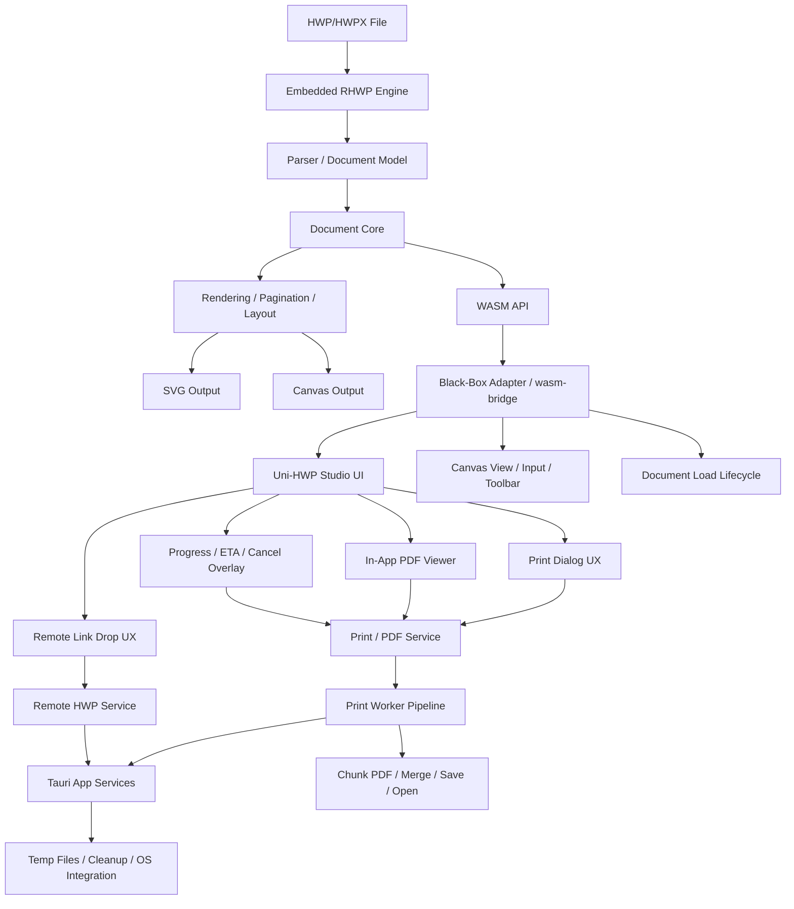

<h1 align="center">Uni-HWP</h1>

<p align="center">
  <strong>Uni-HWP</strong> — 플랫폼의 경계를 허무는 HWP/HWPX 에디터<br/>
  <em>All HWP, Open for Everyone</em>
</p>

<p align="center">
  <a href="https://opensource.org/licenses/MIT"></a>
  <a href="https://www.rust-lang.org/"></a>
  <a href="https://webassembly.org/"></a>
  <a href="https://tauri.app/"></a>
</p>

---

HWP 파일을 **어디서든** 열어보세요.

Uni-HWP는 오픈소스 `rhwp`를 Embedded RHWP Engine으로 포함하고, 그 위에 Black-Box Adapter와 앱 셸을 얹어 실사용 기능을 확장한 HWP/HWPX 뷰어 및 에디터입니다. 닫힌 포맷의 벽을 낮추고, 플랫폼의 경계를 넘어 한글 문서를 더 자유롭게 읽고 쓸 수 있게 하는 것을 목표로 합니다.


## 개발 방향성 및 로드맵

Uni-HWP는 문서의 파싱 및 렌더링을 담당하는 **코어 엔진 영역은 오픈소스 `rhwp`의 upstream 추적성을 최대한 보존**하고, 실사용자의 편의성과 애플리케이션의 완성도를 높이는 앱 계층을 별도로 발전시킵니다.

### 핵심 개발 목표

- **사용자 편의성(UX) 극대화**: 직관적인 인쇄 다이얼로그, PDF 내보내기 진행 상황 시각화(ETA), 인앱(In-app) 뷰어 등 실무에 즉시 투입 가능한 수준의 UX 제공.
- **플랫폼 확장 및 단독 실행**: 브라우저 종속성을 탈피하여 Tauri 기반의 고성능 데스크톱 단독 앱(`src-tauri`) 환경 구축.
- **메모리 및 성능 최적화**: 대용량 문서 처리 시의 메모리 성장 억제 및 안정성 보장, 독립된 Print Worker를 통한 비동기 PDF 청크 렌더링.
- **유연한 원격 자원 연동**: URL 드래그 앤 드롭 한 번으로 외부의 HWP/HWPX 문서를 안전하고 빠르게 에디터에 다이렉트 로드.

### 아키텍처 및 릴리즈 전략

Uni-HWP의 버전 및 릴리즈 관리는 코어 엔진의 호환성을 유지하면서, 사용자와 직접 맞닿는 앱셸(App Shell) 계층의 기능을 지속적으로 확장하는 데 집중합니다.

- **Embedded RHWP Engine Layer**: HWP 5.0 / HWPX 문서 파서, 문단·표·수식 등 핵심 조판 렌더링, 페이지네이션.
- **Black-Box Adapter Layer**: Uni-HWP 앱이 엔진 내부 구현에 직접 의존하지 않도록 안정된 경계를 제공.
- **Uni-HWP App Shell Layer**: 
  - WASM Bridge 고도화 및 메모리 관리 체계 개선
  - 강력한 인쇄/PDF 통합 파이프라인 제공
  - 파일 입출력 및 외부 리소스(Drag & Drop) 처리의 안정성 확보

---

## Features

### Advanced Workflows (Uni-HWP 특화 기능)
- **Print & PDF Export**: 향상된 다이얼로그와 ETA 계산, 대용량 PDF 청크 기반 병합 처리
- **Remote Link Drop**: 보안이 강화된 외부 링크 드래그 앤 드롭 다이렉트 렌더링
- **Desktop Application**: Tauri 기반의 고성능 데스크톱 앱 모드 지원


## Quick Start (소스 빌드)

### Requirements
- Rust 1.75+
- Node.js 18+ (for web editor)
- Docker (for WASM build)
- Tauri CLI (for Desktop app build)

### Native Build

```bash
cargo build                    # Development build
cargo build --release          # Release build
cargo test                     # Run tests (755+ tests)
```

### WASM Build

```bash
cp .env.docker.example .env.docker
docker compose --env-file .env.docker run --rm wasm
```

### Web Editor & Desktop App

```bash
# Web Editor 실행
# Uni-HWP Studio 앱 셸
cd apps/studio
npm install
npx vite --host 0.0.0.0 --port 7700

# Tauri Desktop App 실행
npm run tauri dev
```

## Maintenance Documents

RHWP 엔진 업그레이드 및 Uni-HWP 유지보수에 필요한 핵심 문서는 `docs/public/maintenance` 아래에 정리되어 있습니다.

- `docs/public/maintenance/RHWP_ENGINE_API_INVENTORY.md`
- `docs/public/maintenance/RHWP_ENGINE_COMPATIBILITY_CHECKLIST.md`
- `docs/public/maintenance/RHWP_ENGINE_INTEGRATION_DEVELOPMENT_PLAN.md`
- `docs/public/maintenance/RHWP_ENGINE_INTEGRATION_DEVELOPMENT_SPEC.md`
- `docs/public/maintenance/RHWP_ENGINE_INTEGRATION_REQUIREMENTS.md`
- `docs/public/maintenance/RHWP_ENGINE_UPDATE_RUNBOOK.md`
- `docs/public/architecture/RHWP_INTEGRATION_PRESERVATION_ARCHITECTURE.md`
- `docs/public/architecture/RHWP_INTEGRATION_PRESERVATION_FRAMEWORK.md`

문서 구조 가이드는 `docs/README.md`에서, 배포 브랜치 문서 분류 기준은 `docs/public/release/RELEASE_DOCUMENT_CLASSIFICATION.md`에서 확인할 수 있습니다.

## Architecture



## HWPUNIT

- 1 inch = 7,200 HWPUNIT
- 1 inch = 25.4 mm
- 1 HWPUNIT ≈ 0.00353 mm

## Contributing

See [CONTRIBUTING.md](CONTRIBUTING.md) for guidelines.

## Product Information

1. **제품 및 제조사 정보 (Product & Manufacturer)**
  - 제품명 (Product): Uni HWP
  - 버전 (Version): 8.1.101
   - 제조사 (Manufacturer): Uni-HWP Studio
   - Copyright © 2026 Uni-HWP Studio

2. **오픈소스 라이선스 (Open Source License)**
   - 본 제품은 오픈소스 프로젝트 rhwp를 기반으로 고도화되었습니다. (This product has been advanced based on the open-source project rhwp.)
   - 원저작자 (Original Author): rhwp
   - 본 소프트웨어 및 원저작물은 MIT 라이선스를 준수하며, 상업적/비상업적 목적으로 무료로 자유롭게 사용 가능합니다. (This software and original works comply with the MIT License and are free to use for both commercial and non-commercial purposes.)

   **rhwp Dependencies Licenses**
   - wasm-bindgen, web-sys, js-sys: MIT / Apache-2.0
   - cfb, flate2: MIT
   - byteorder: MIT / Unlicense
   - base64, console_error_panic_hook: MIT / Apache-2.0

3. **상표권 및 권리 고지 (Trademark & Rights Notice)**
   - 본 제품은 주식회사 한글과컴퓨터의 한글 문서 파일(.hwp) 공개 문서를 참고하여 개발되었습니다. (This product was developed by referring to the official HWP file format documentation provided by Hancom Inc.)
   - "한글", "한컴", "HWP", "HWPX"는 주식회사 한글과컴퓨터의 등록 상표입니다. 본 소프트웨어는 해당 상표권자와 무관한 독립적 결과물임을 알립니다. (Hangul, Hancom, HWP, and HWPX are registered trademarks of Hancom Inc. This software is an independent result and is not affiliated with the trademark holder.)
   - **UNI-HWP IS AN INDEPENDENT SOFTWARE PROJECT.**

## License

본 프로젝트는 [MIT 라이선스](LICENSE)를 따릅니다.
This project is licensed under the [MIT License](LICENSE).
