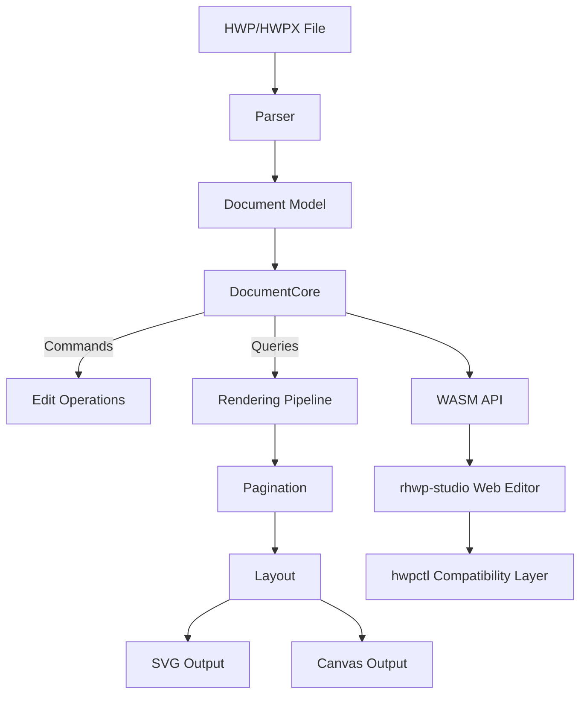
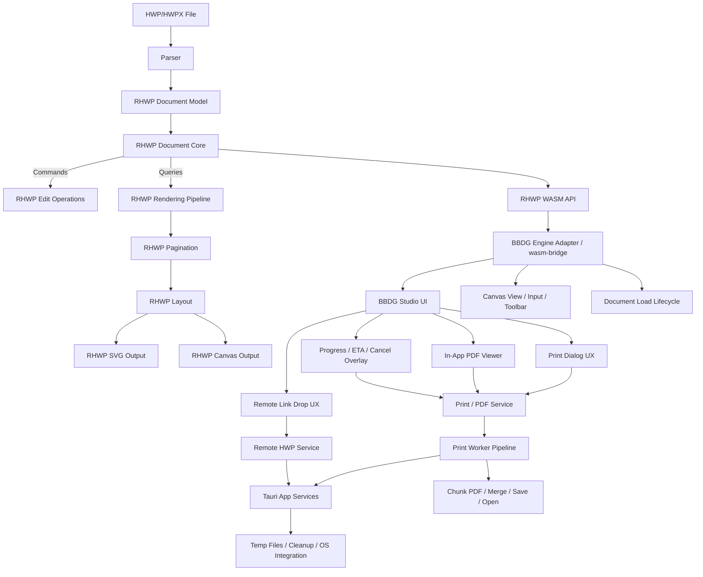

# RHWP Integration Preservation Framework Architecture

Project:
- `RHWP Integration Preservation Framework`
- `RHWP 엔진 통합 보존 프레임워크`

## 목적

이 문서는 RHWP의 원본 아키텍처를 기준으로, BBDG HWP Editor가 RHWP 엔진을 어떻게 통합하고 보존해야 하는지 아키텍처 관점에서 정의한다.

핵심 목표는 다음 세 가지다.

1. RHWP 엔진은 계속 upstream 업데이트를 받을 수 있어야 한다.
2. BBDG 전용 기능, UX, 인쇄/PDF/link-drop 흐름은 유지되어야 한다.
3. 엔진 코어와 제품 기능의 경계가 문서화되어 있어야 한다.

이 아키텍처는 특히 아래 두 운영 원칙을 기술 구조로 뒷받침하기 위해 존재한다.

- RHWP 엔진 코어는 가능한 한 직접 건드리지 않는다.
- RHWP upstream 엔진 업데이트는 확인 가능한 즉시 검토하고 반영 가능성을 평가한다.

즉, 이 문서는 단순 구조 설명서가 아니라
“왜 BBDG 기능을 RHWP 코어 밖에 두어야 하는가”
를 설명하는 보존 아키텍처 문서다.

## RHWP 기준 아키텍처

사용자가 제시한 RHWP 원본 구조는 아래와 같이 이해한다.



이 구조에서 RHWP는 크게 다음 네 층으로 볼 수 있다.

- 파일 해석 층: `Parser`
- 문서 상태/명령 층: `Model`, `DocumentCore`, `Edit`
- 렌더링 층: `Render`, `Pagination`, `Layout`, `SVG`, `Canvas`
- 외부 노출 층: `WASM API`, `rhwp-studio`

## RHWP 엔진 통합 보존 프레임워크 아키텍처

BBDG HWP Editor는 RHWP 위에 직접 제품 기능을 뒤섞는 대신, 아래 구조로 RHWP를 감싼다.



## 계층별 책임

이 계층 분리는 단순한 취향 문제가 아니다.

분리 이유는 명확하다.

1. RHWP 코어를 가능한 한 손대지 않기 위해
2. RHWP 업데이트를 더 자주, 더 가볍게 확인/반영하기 위해
3. BBDG 전용 UX와 제품 흐름을 RHWP 업데이트 충격에서 분리하기 위해
4. 기능 보존과 엔진 교체 가능성을 동시에 확보하기 위해

## 1. RHWP Core Layer

구성:

- `src/**/*.rs`
- `src/wasm_api.rs`
- `pkg/*`

책임:

- HWP/HWPX 파싱
- 문서 모델 구성
- 편집 명령 처리
- 페이지 계산
- SVG/Canvas 출력
- WASM API 노출

비책임:

- BBDG 메뉴 UX
- 인쇄 대화창 UX
- PDF 워커 오케스트레이션
- ETA 계산
- 진행 오버레이
- 링크 드롭 다운로드/정리
- 내부 PDF 뷰어 UX

아키텍처 원칙:

- RHWP Core는 교체 가능한 엔진으로 취급한다.
- BBDG 제품 흐름은 가능한 한 이 층에 넣지 않는다.
- 코어 수정이 필요하면 upstream 일반 기능인지 먼저 판단한다.
- 이 층이 얇고 안정적일수록 upstream 업데이트를 즉각 검토하고 반영하기 쉬워진다.

## 2. Engine Adapter Layer

구성:

- `rhwp-studio/src/core/wasm-bridge.ts`

책임:

- RHWP WASM 초기화
- document lifecycle 보호
- 앱이 쓰는 안정 API 제공
- RHWP API 변경 흡수
- retired/null/pre-load 상태 방어

아키텍처 원칙:

- 앱은 RHWP raw API 대신 adapter를 통해 엔진을 사용한다.
- RHWP 업데이트 충격은 우선 이 층에서 흡수한다.
- Adapter는 엔진 경계이지, 제품 UX 구현체가 아니다.
- 즉, “코어를 직접 건드리지 않는다”는 원칙을 현실적으로 가능하게 만드는 완충층이다.

## 3. BBDG Studio UI Layer

구성:

- `rhwp-studio/src/main.ts`
- `rhwp-studio/src/ui/**`
- `rhwp-studio/src/view/**`
- `rhwp-studio/src/engine/**`
- `rhwp-studio/src/command/**`

책임:

- 메뉴와 편집기 UX
- 인쇄 진입 흐름
- 페이지 표시 UX
- 문서 교체 흐름
- 입력/선택/도구막대
- 링크 드롭 진입과 사용자 피드백
- PDF 뷰어와 편집기 복귀 UX

아키텍처 원칙:

- 사용자가 느끼는 흐름은 이 층에서 관리한다.
- RHWP 렌더링 결과를 제품 경험으로 엮는 역할을 한다.
- RHWP 엔진 업데이트 후에도 이 층의 흐름은 최대한 유지해야 한다.
- RHWP 업데이트가 즉시 검토/반영되더라도 사용자 경험이 흔들리지 않게 이 층에서 제품 정체성을 붙잡는다.

## 4. BBDG Product Services Layer

구성:

- Print / PDF Service
- Remote HWP Service
- Progress / ETA State
- Viewer Control

대표 파일:

- `rhwp-studio/src/command/commands/file.ts`
- `rhwp-studio/src/command/link-drop.ts`
- `rhwp-studio/src/ui/print-options-dialog.ts`
- `rhwp-studio/src/ui/print-progress-overlay.ts`
- `rhwp-studio/src/pdf/pdf-preview-controller.ts`

책임:

- 인쇄 범위/방식 선택
- PDF 생성 orchestration
- 청크 처리
- 진행률 계산
- 전체 ETA 계산
- 학습 기반 평균치 반영
- 취소 처리
- 앱 내부 PDF 뷰어 연결
- 원격 문서 판별/오류 안내

아키텍처 원칙:

- RHWP는 페이지 데이터 제공까지만 책임지고,
  실제 제품 수준의 인쇄 경험은 이 층에서 완성한다.
- 따라서 RHWP 업데이트를 자주 받아도 print/PDF/link-drop 같은 BBDG 가치가 코어 변경에 직접 종속되지 않는다.

## 5. Worker / Tauri Integration Layer

구성:

- `scripts/print-worker.ts`
- `src-tauri/src/**`

책임:

- 워커 실행
- PDF 청크 생성/병합/저장
- 임시 파일 생성과 정리
- 원격 HWP/HWPX 다운로드
- OS 수준 열기/파일 처리

아키텍처 원칙:

- 브라우저/앱 메인 UI가 무거운 작업에 막히지 않도록 분리한다.
- OS 의존 동작은 Rust/Tauri 서비스로 격리한다.
- 이 격리는 RHWP 코어 수정 없이도 제품 기능을 계속 확장할 수 있게 해준다.

## 보존 프레임워크의 핵심 연결 규칙

이 프레임워크에서 가장 중요한 연결은 아래 네 개다.

### 1. RHWP Core -> Adapter

- 직접 연결 지점을 한 곳으로 좁힌다.
- 엔진 변경 충격을 adapter에서 흡수한다.

### 2. Adapter -> Studio UI

- UI는 안정된 제품 API만 본다.
- RHWP 내부 구조 변경이 UI 전반으로 번지지 않게 한다.

### 3. Studio UI -> Product Services

- BBDG UX는 서비스 계층과 분리해 유지한다.
- 인쇄/PDF/link-drop 같은 제품 흐름은 RHWP 코어 밖에 남긴다.

### 4. Product Services -> Worker/Tauri

- 무거운 작업은 백그라운드로 넘긴다.
- 진행률/ETA/취소는 UI가 계속 살아 있도록 설계한다.

## 데이터 흐름

## A. 문서 로드 흐름

```text
Local/Remote File
-> RHWP Parser
-> RHWP Document Model
-> RHWP WASM API
-> BBDG Engine Adapter
-> Canvas View / Input / Toolbar / Validation Flow
```

설계 포인트:

- 문서가 교체될 때 old document가 UI에 남지 않도록 adapter가 lifecycle을 관리한다.
- pre-load 상태 입력과 hitTest noise는 adapter/UI 경계에서 차단한다.

## B. 화면 렌더링 흐름

```text
Document Core
-> Rendering Pipeline
-> Pagination
-> Layout
-> SVG/Canvas Output
-> Engine Adapter
-> Canvas View page window
-> User-visible Editor Surface
```

설계 포인트:

- RHWP는 렌더링 결과를 만든다.
- BBDG는 page window, canvas pool, viewport UX를 관리한다.

## C. PDF 내보내기 흐름

```text
Print Dialog
-> Product Print Service
-> Engine Adapter
-> Page SVG Extraction
-> Print Worker
-> Chunk PDF Generation
-> PDF Merge
-> Save/Open
-> In-App PDF Viewer
```

설계 포인트:

- RHWP는 SVG 추출까지만 책임진다.
- PDF 생성/병합/저장은 RHWP 코어 밖에서 처리한다.
- 진행률, ETA, 취소는 제품 서비스 계층에서 책임진다.

## D. 원격 링크 드롭 흐름

```text
Browser Drag Data
-> Link Candidate Extraction
-> URL / Header Detection
-> Tauri Remote Download
-> Temp File
-> Engine Adapter Load
-> Editor Surface Update
-> Cleanup
```

설계 포인트:

- 네트워크/헤더/임시 파일 처리는 RHWP 엔진이 아니라 BBDG 서비스가 맡는다.
- RHWP는 최종 문서 bytes 또는 file load 단계만 맡는다.

## 변경 허용 경계

이 아키텍처에서 변경은 아래 우선순위로 허용한다.

1. UI/Service 계층에서 해결
2. Adapter 계층에서 흡수
3. Tauri/Worker 계층에서 보조
4. 마지막 수단으로 RHWP Core 수정

즉, BBDG 제품 문제를 바로 RHWP 코어에 넣는 방향은 원칙적으로 금지한다.

이 우선순위 자체가 아래 두 원칙을 구현한 것이다.

- RHWP 엔진을 가능한 한 직접 건드리지 않는다.
- RHWP 업데이트를 가능한 한 즉각 확인/반영할 수 있도록 코어 의존 오염을 줄인다.

## 아키텍처 검증 질문

향후 어떤 변경이 들어와도 아래 질문으로 검증한다.

1. 이 변경은 RHWP Core에 꼭 들어가야 하는가?
2. Adapter에서 흡수할 수 없는가?
3. BBDG UI/Service 계층에서 해결할 수 없는가?
4. 이 변경이 현재 BBDG UX를 약화시키지 않는가?
5. RHWP 업데이트 수용성을 높이는 방향인가, 오히려 낮추는 방향인가?

## 최종 원칙

`RHWP 엔진 통합 보존 프레임워크`의 아키텍처는
“RHWP를 최대한 교체 가능하게 유지하되, BBDG 제품 경험은 절대 얇아지지 않게 만든다”
는 원칙 위에 서 있다.

그리고 그 원칙은 결국 아래 두 문장으로 다시 수렴한다.

- RHWP 코어는 가능한 한 건드리지 않는다.
- RHWP upstream 업데이트는 가능한 한 즉시 검토하고 반영할 수 있는 구조를 유지한다.

따라서 이 아키텍처의 성공 기준은 다음과 같다.

- RHWP upstream 업데이트를 다시 받아들일 수 있다.
- BBDG 업그레이드 기능이 유지된다.
- BBDG UI/UX 흐름이 유지된다.
- 인쇄/PDF/link-drop 같은 제품 가치가 RHWP 코어 밖에서 안정적으로 유지된다.
