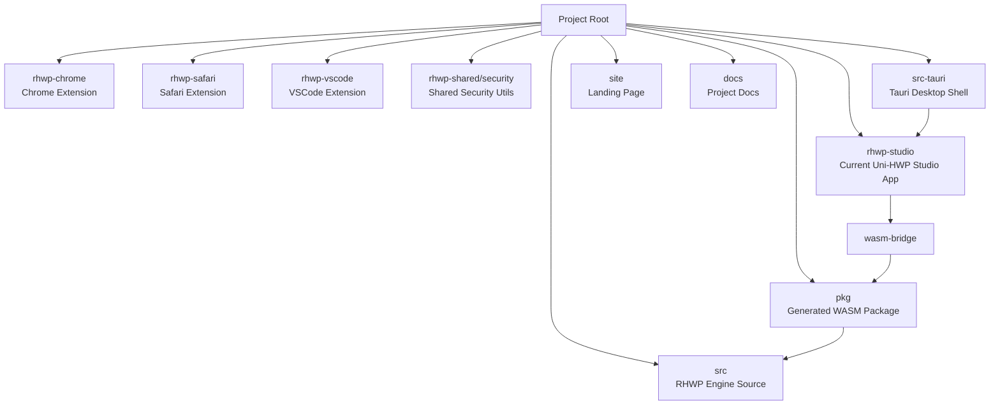
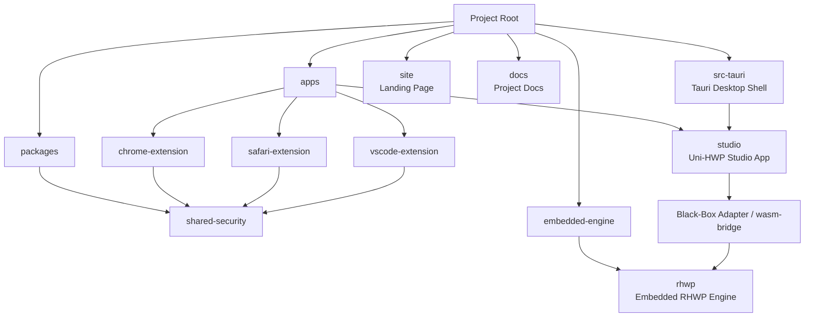
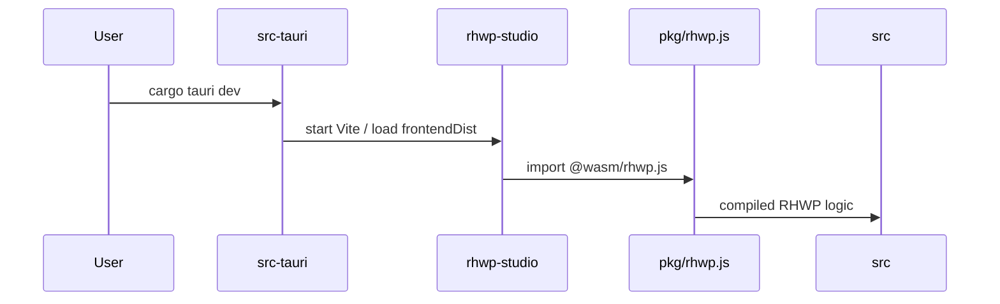
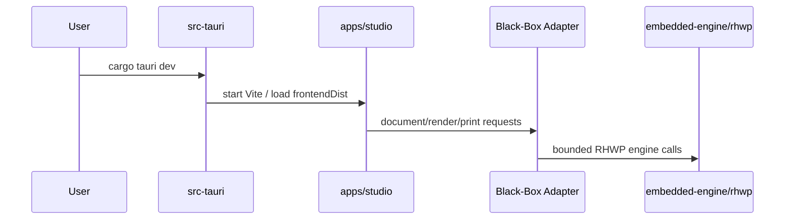
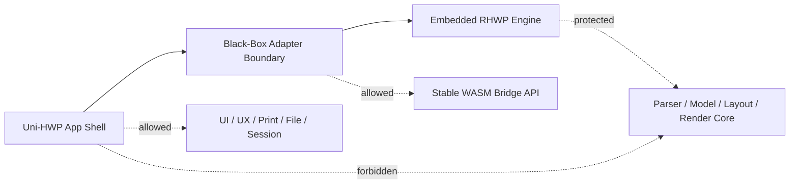

# Uni-HWP Core Engine Restructure Architecture Comparison

문서 버전:
- `8.1.102`

## 1. 목적

현재 구조와 리팩토링 후 목표 구조를 Mermaid 다이어그램으로 비교한다.

## 2. 현재 구조

현재는 Uni-HWP 앱 셸, 확장 모듈, 공유 유틸이 루트에서 `rhwp-*` 이름으로 직접 노출된다.

### 현재 구조의 문제

- 루트에서 `rhwp-*` 이름이 먼저 보여 Uni-HWP 브랜드 구조가 약해 보인다.
- 앱, 확장, 공유 패키지, 엔진 경계가 한눈에 구분되지 않는다.
- 어떤 `rhwp`가 upstream 엔진이고 어떤 `rhwp`가 앱/확장 흔적인지 혼동될 수 있다.

## 3. 목표 구조

목표는 앱과 패키지를 Uni-HWP 프로젝트 구조로 재배치하고, RHWP 엔진은 Embedded Engine 경계 안에 위치시키는 것이다.

### 목표 구조의 장점

- 루트에서 Uni-HWP 중심 구조가 먼저 보인다.
- 앱, 확장, 패키지, 엔진 경계가 명확하다.
- `rhwp` 이름은 Embedded Engine 내부로 제한된다.
- RHWP upstream 업데이트 시 엔진 경계를 기준으로 교체/비교할 수 있다.

## 4. 앱 실행 흐름 비교

### 현재 실행 흐름

### 목표 실행 흐름

## 5. 경계 정책

정책:

- App Shell은 Engine Core를 직접 만지지 않는다.
- Adapter가 Engine 호출을 감싼다.
- Engine 내부의 `rhwp` 이름은 보존한다.
- 외부 루트 구조에서는 `rhwp` 노출을 줄인다.

## 6. 결론

권장 방향:

1. `rhwp-studio`를 먼저 `apps/studio`로 이동한다.
2. 빌드와 실행이 정상인지 검증한다.
3. 확장 모듈은 앱과 분리하여 `apps/*-extension`으로 이동한다.
4. 공유 보안 유틸은 `packages/shared-security`로 이동한다.
5. 진짜 엔진 소스의 이동은 가장 마지막에 판단한다.

이 순서는 사용자 기능을 보호하면서 루트 구조를 점진적으로 Uni-HWP 중심으로 정리하는 가장 안전한 방식이다.
